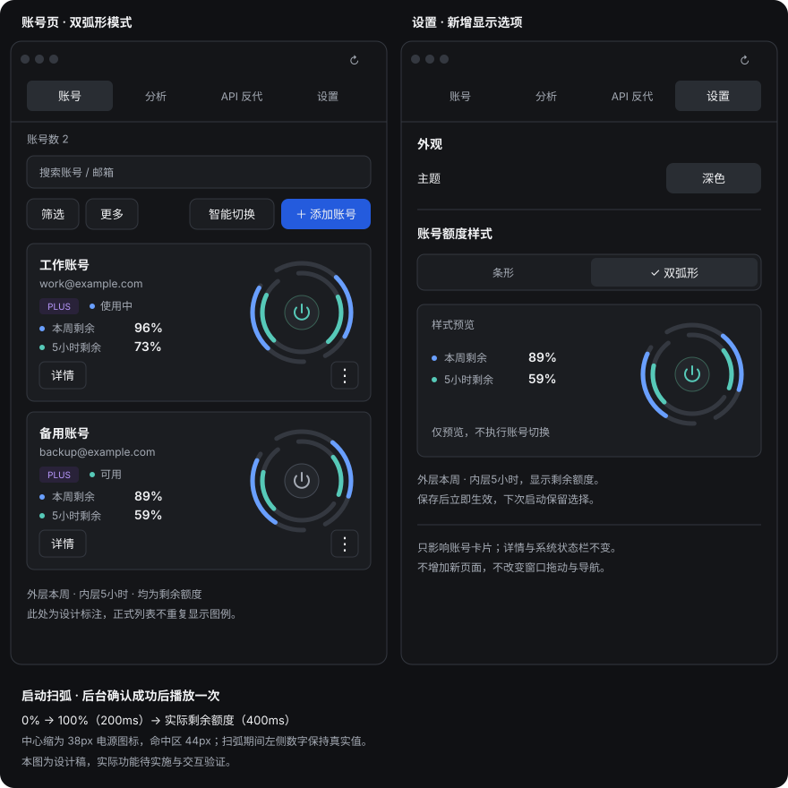

# Codex Tools 紧凑单列 UI/UX 重设计与执行计划

> 决策：全应用采用一套小面板紧凑布局，废弃小 / 中 / 大三档方案。
> 默认窗口：420 × 720（横向最窄）；最小窗口：420 × 560。默认双圆环与黑色主题，放大只增加可见空间。

## 页面结构

1. 独立标题栏：为 macOS 窗口控制按钮预留空间；不显示 Logo / 应用名称，空白区用于拖动，右侧为主题 / 刷新，所有尺寸保留拖动。
2. 四项导航：账号、分析、API 反代、设置，始终一行四等分。
3. 账号页：一行简要概览、搜索、操作、折叠筛选、单列账号列表。
4. 账号详情：替换同一内容区，顶部返回；不使用常驻侧栏、上下双面板或模态抽屉。
5. Token 汇总与全部导出默认折叠；切换记录有内容时才出现，默认折叠。

## 交互规则

- 点击账号主体 / 详情入口只查看详情；切换按钮只执行切换。
- 当前账号显示使用中；切换期间锁住所有切换入口，结束后读取后台实际状态并反馈。
- 键盘操作子按钮不能意外打开详情；返回列表恢复触发控件焦点与滚动位置。
- Escape 返回列表，编辑中的 Escape 优先取消编辑。
- 详情保留完整身份、套餐、额度、重置时间、会员到期、重置卡、反代开关及账号操作。
- 筛选默认折叠，展开参与布局。尺寸变化保留搜索、筛选、选择与草稿。
- 未知数据不伪装成零；刷新保留已有数据与明确的刷新状态。
- 状态栏只显示进度，不显示 5h / 1w 标签；应用内保留周期含义。
- 版本 / 检查更新 / 项目链接 / 反馈 / 发布与日志模块已删除；没有启动或定时更新检查、更新菜单和更新调试浮层。

## 视觉规范

| 元素 | 规范 |
| --- | --- |
| 背景 | 首次打开默认深色；中性石墨灰 / 浅灰白，记住用户主动切换的主题 |
| 文字 | 正文 13–14px，400–500 字重；名称与额度 600；辅助文字 12px |
| 按钮 | 平色、8px 左右圆角、36–40px 高，无浮起和发光 |
| 账号项 | 两到三行，自然高度，轻边界与细分隔线，无嵌套卡片 |
| 额度 | 可选条形 / 双弧形；两种模式的数字与图形均表达剩余比例 |
| 详情 | 紧凑信息行，语义分组之间用分隔线 |
| 布局 | 全宽单列；主页面无横向滚动，表格 / 日志可局部横向滚动 |
| 间距 | 内容左右各 18px，账号卡内边距 14px，卡间距 12px；搜索与操作区留出独立间距 |

## 新增设计：双弧形额度模式

> 双弧形模式已实现于工作区，尚未打包发布。新增选项，不改变默认紧凑单列布局；下图为静态设计稿，实际实现与验证记录见文末。

### 设置入口与生效范围

- 在「设置」的主题选项下提供「账号额度样式」，单选「条形」「双弧形」。默认双弧形；保留用户主动保存的有效选择。
- 选项下显示一个静态、不可操作的额度预览，辅助说明「外层本周 · 内层5小时，显示剩余额度」。不新增独立设置页面。
- 保存成功立即更新全部账号卡片，无须重启；保存中禁用样式选项，失败保留原选择并提示。切换期间也不重建账号列表，保留焦点、滚动、搜索及筛选。
- 只改变账号列表的额度与切换按钮布局。账号详情继续用条形与完整周期说明；系统状态栏维持原样，不增加 5h / 1w 标签。

### 账号卡片布局

- 左侧为身份与额度数字，右侧为固定 126 × 126px 双弧操作区。当前模式不再在底部重复放切换按钮。
- 名称 / 邮箱单行省略；完整身份在详情中可访问。套餐与状态保留。两行额度分别为「本周剩余 89%」「5小时剩余 59%」，以对应的色点辅助识别。
- 「详情」与更多菜单保留在底部，同属一个账号卡片，无嵌套模块。卡内边距 14px、左右区间距 12px、卡间距 12px。
- 在最小 420px 窗口下，页面内宽 384px、卡片内容宽 354px，右侧 126px、间隔 12px，左侧剩余 216px。所有按钮完整可见，名称缩略不挤压双弧。
- 放大窗口仍为同一单列结构，不放大仪表、不恢复侧栏。账号额度模式切换不改变标题栏拖动区。

### 弧形规范

| 项目 | 设计 |
| --- | --- |
| 形状 | 同心 270° 圆弧，底部留 90° 缺口；从左下起点经顶部向右下顺时针增加 |
| 外层 | 本周剩余额度，半径 55px，蓝色 `#699FFF` |
| 内层 | 5小时剩余额度，半径 44px，青色 `#56C9B8` |
| 轨道 | 5px 粗、圆头；暗色轨道 `#343840`，亮色沿用主题轨道变量 |
| 数值 | 剩余值映射到完整 270° 弧长，100% 为满弧、0% 仅轨道；不将未知值当成 0% |
| 中心按钮 | 仪表盘式电源 / 启动图标，图标 18px、可见圆底直径 38px、实际命中区至少 44 × 44px；不放文字或百分比，不发光 |
| 提示 | 弧区悬停 / 键盘聚焦显示两周期剩余值、重置时间及数据更新时间；详情入口提供同样信息，不依赖悬停 |
| 动效 | 成功切换播放一次启动扫弧：0 → 100% → 实际剩余值，约 600ms；普通刷新仅 180ms 长度过渡；无持续动画，尊重减少动态效果设置 |

### 仪表盘启动动效

保留双弧而不新增时速数字、装饰指针或密集刻度。中心圆形启动图标缩小，留出内弧与图标之间的负空间。

1. 点击中心启动图标后，等待后台切换结果。此时保留真实额度弧，图标显示等待态，不提前播放成功扫弧。
2. 后台确认目标为当前账号后，立即将两条**展示弧**置零，同时以 200ms ease-out 扫至 100%（完整 270°，不是完整圆周）。
3. 不在满弧停顿，再以 400ms ease-in-out 分别回落到本周 / 5小时的实际剩余值。例如外弧 0 → 100 → 89%，内弧 0 → 100 → 59%。两个周期同步启动，各自落到自己的值。
4. 中心图标在成功确认后变为绿色启用态；动画结束不弹跳、不重复。原账号恢复可切换的灰色电源图标，原账号不播放归零动画。

- 扫弧是启动反馈，不是额度恢复。左侧数字、业务额度与无障碍读数始终是真实值，不跟随动画显示 0 / 100%，也不写回后台。
- 只有一次明确的切换成功事件触发动效。打开页面、切换展示模式、排序、返回详情和普通刷新均不重播。
- 切换失败保留原进度，不播放扫弧。额度未知的周期不扫到 100%，维持未知轨道与「—」；另一周期有值时可正常播放。
- 尚未取得新额度时落到最后有效值并标记数据时间，更新到达后平滑修正；数据在扫弧期间到达则以最新值作为回落目标，不重新播放启动阶段。
- 扫弧不延迟成功反馈、不延长后台切换锁。发生下一次切换、切换样式或卸载卡片时取消旧动画，避免旧回调覆盖新账号状态。
- 减少动态效果开启时，直接显示实际值与启用图标。系统只朗读一次切换成功，不朗读每帧额度。

### 切换与异常状态

| 状态 | 中心按钮与反馈 |
| --- | --- |
| 可用账号 | 灰色电源图标，可点击；悬停 / 聚焦提示「切换到此账号」，仅中心命中执行操作 |
| 当前账号 | 绿色电源图标，禁用；左侧保留「使用中」，辅助名称「当前账号已启用」，不只依赖颜色 |
| 切换中 | 目标为小型等待图标，辅助名称「正在切换账号」；锁住所有切换按钮，仪表与详情仍可阅读 |
| 切换成功 / 失败 | 成功启用目标图标并播放一次扫弧；失败恢复按钮，在页面显示原因，不提前改为启用态 |
| 额度不足 | 剩余低于 15% 对应弧变琥珀色，0% 变红并明确显示「已耗尽」；阈值沿用现有规则，不另外增加设置 |
| 未知 / 拉取失败 | 对应轨道无彩色进度，数字「—」；保留已有有效值时标记过期或刷新失败。不仅因缺少额度数据禁用切换 |
| 需要重新授权 | 中心钥匙图标，提示「重新授权」，执行现有授权入口，不尝试切换；显示异常原因 |

启用图标表示当前账号已切换成功，不等同于外部 Codex 应用已经启动；只有真实启动结果才能用于提示外部应用已启动。

### 无障碍与实现边界

- SVG 仅作图形，用真实 HTML button 放在中心，保留 Tab、Enter / Space、可见焦点和禁用语义；图标按钮提供包含目标账号的辅助名称，中心点击停止冒泡，不能误打开详情。
- 两条额度各有独立可读的周期与剩余百分比。若使用 progressbar，未知值省略 aria-valuenow；装饰 SVG 隐藏，避免重复朗读。
- 外 / 内位置、文字与数值共同识别周期，不能只依赖颜色。进度接近 0% 时不画圆头色点冒充非零值。
- 持久化字段 `accountQuotaDisplayMode: "bars" | "dualArc"`；缺失 / 非法值回退双弧形，与现有系统状态栏显示设置分开。
- 复用现有 remainingPercent、额度异常、授权、切换忙碌判断和 handleSwitch；仅新增一个 SVG 展示分支，不引入图表库、不复制业务逻辑。

### 本功能实施与验收

1. 增加设置字段、默认值、读写兼容与多语言文案。
2. 设置中加入两种样式单选与静态预览；保存失败可恢复。
3. 账号卡片增加双弧展示，复用现有切换与授权处理；移除该模式的重复切换入口。
4. 验证 420 × 560、560 × 720 及宽窗口，深 / 浅色、长邮箱、0 / 1 / 20 个账号均无水平溢出。
5. 覆盖额度 0 / 1 / 14 / 15 / 99 / 100% 与未知、不同周期单独耗尽、旧数据刷新失败。
6. 覆盖模式保存 / 重启恢复 / 失败、切换成功 / 失败 / 并发、当前账号、重新授权、详情返回、键盘焦点；确认弧形空白不执行切换，窗口仍可拖动。
7. 验证成功后的 0 → 100 → 实际值只播放一次，数字不造假；失败不扫弧、未知周期不造满额、0% 最终无彩色弧、100% 最终满弧、减少动态效果直接落位、快速后续操作取消旧动画。

## 执行计划

| 步骤 | 完成标准 |
| --- | --- |
| 1 | 更新本文，清除三档设计与冲突布局规则 |
| 2 | 独立标题栏与固定四项导航；窄窗口拖动、按钮命中正确 |
| 3 | 精简概览与工具栏，重做账号项，删除 720px 最小行宽 |
| 4 | 详情 / 返回 / 焦点恢复，原有功能可访问 |
| 5 | 两套主题、默认小窗口、折叠次要模块、关闭默认调试浮层 |
| 6 | 构建、静态检查、模拟账号操作与原生标题栏验证 |
| 7 | 回归分析 / 反代 / 设置及相关弹窗，记录实际覆盖范围 |

## 验收矩阵

- 尺寸：420 × 560、560 × 720、980 × 760、1440 × 900；暗色与亮色。
- 数据：0 / 2 / 20 个账号、长邮箱、不同套餐、异常 / 耗尽 / 未知额度。
- 主路径：搜索、筛选、清除、详情、返回、切换成功 / 失败 / 并发限制。
- 入口：更多、重命名、反代、重授权、预热、导出、删除确认取消、添加取消。
- 公共页面：导航、分析表格、反代表单、设置与弹窗无整页溢出。
- 原生：最小窗口可拖动、按钮不拖动、双击标题区可缩放。
- 模拟验证不代表真实 OAuth、远程部署、后台账号切换与外部应用启动已验证。

## 执行与测试结果

### 双弧形模式（2026-09-14）

- 已实现：设置单选与不可操作预览、持久化字段、默认 / 未知枚举兼容、五种语言文案、双弧与 44px 命中区的小型启动图标、当前 / 等待 / 重新授权状态。
- 后台成功且账号列表确认当前账号后触发扫弧；中心按钮、详情切换、智能切换复用同一事件。动画 600ms，数字与无障碍读数不随扫弧造假；未知周期不动画，0% 最终隐藏彩色弧。
- 模拟浏览器已覆盖：420 × 560、560 × 720，深 / 浅色，两种样式切换，20 个账号与长邮箱，无整页水平溢出；可用 / 禁用中心偏移均为 0、命中区 44 × 44px。标题栏拖动区保留，未改动原生拖动处理。
- 已验证：切换忙碌锁、成功帧序列与正确落位、切换失败不扫弧、设置保存失败保留选择、未知周期与 0%、100% 与 14% 警告、减少动态效果不扫弧、详情返回焦点、返回不重播、设置方向键操作、智能切换成功与无目标反馈。
- 可重复检查：`node --test tests/quotaArc.test.ts`；Rust `cargo test account_quota_mode_persists_and_accepts_legacy_settings --lib`。额度弧单测覆盖 0 / 59 / 89 / 100%、越界 / 非有限值及扫弧帧；Rust 验证缺失 / 非法值回退、序列化恢复与设置补丁。
- 最终检查：`npm run build` 通过；额度弧、额度引导与刷新错误共 22 项前端测试通过，新增 Rust 测试通过；`git diff --check` 通过。静态检查无错误，保留 controller 中原有的 Hook 依赖警告；构建保留主包体积提示。
- 模拟预览：`npm run dev -- --host localhost` 后打开 `/tests/ui-preview.html?quota=dualArc`。可追加 `count=20`、`fail-switch`、`fail-settings`、`week=0&five=unknown` 或 `week=100&five=14`；模拟 IPC 不修改真实账号。
- 验证边界：本次没有对真实账号执行切换 / OAuth，也没有重新打包并验证原生窗口拖动。高频取消、扫弧中额度更新与重新授权入口仍需真实后台集成回归；不得将模拟通过视为这些外部链路已验证。

### 改为自行维护版本（2026-09-14）

- 删除设置页整组版本 / 更新 / 项目入口，包括版本号、检查更新、仓库链接、反馈、版本发布与更新日志；保留其余设置及双弧样式。
- 删除启动检查、每小时检查、更新下载安装 / 重启逻辑、更新弹窗与其调试浮层、应用菜单检查更新项、前后端更新与重启插件依赖及权限，关闭 updater artifacts 并移除远程更新端点配置。
- 历史文档、构建必要的包版本元数据和旧设置兼容字段保留；不修改真实账号或删除持久化设置。删除的组件源文件可通过 Git 恢复。
- 模拟设置页确认：相关入口为 0、空分组为 0、无整页横向溢出、双弧设置仍存在。新增 `tests/manualMaintenance.test.ts` 防止相关界面与自动更新入口回归。
- 前端构建及 Rust `cargo check --lib` 通过；不代表已打包发布或原生菜单实机回归已完成。

### 启动默认值（2026-09-14）

- 默认窗口 420 × 720，宽度等于最小允许宽度；最小高度仍为 560，默认高度不变。
- 默认双弧形；后端默认枚举、默认设置、前端初始化与缺失值回退、模拟预览默认值保持一致。已有有效条形偏好仍保留。
- 无有效主题偏好时默认黑色主题；HTML 初始主题也设为 dark，减少首次打开亮色闪烁。已保存的有效主题仍尊重用户选择。
- 无参数模拟预览默认显示双弧；420 × 720 下无整页水平溢出，标题栏拖动空白宽 252px。此预览环境已有手动亮色偏好，因此不会强行重置为黑色。
- 最终构建、25 项前端测试、Rust 设置兼容性测试及差异格式检查通过；静态检查无错误，保留原有 Hook 依赖警告。
